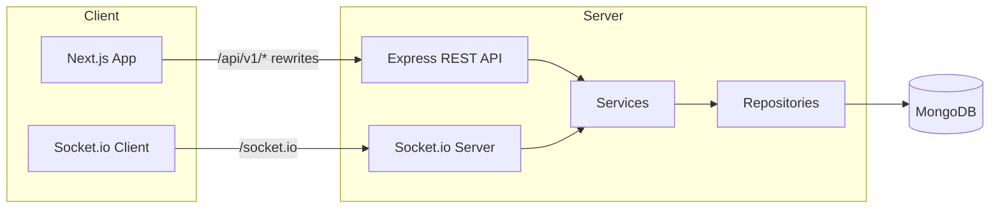

# Planora

Planora is a production-oriented, full-stack project management platform with Kanban boards, real-time collaboration, team workflows, and fine-grained access control. Built as a monorepo with a layered Express API and a feature-based Next.js frontend.

---

## Highlights

- **Kanban boards** — columns, drag-and-drop task cards, board backgrounds, and an all-tasks view
- **Real-time updates** — Socket.io rooms for live board and project events across connected clients
- **Team collaboration** — invites, member roles, project group chat, and an activity feed
- **Rich task management** — priorities, due dates, assignees, labels, checklists, comments, and attachments
- **Advanced search & filters** — global search with priority, assignee, due-date, project, and board scoping
- **Custom RBAC** — default Owner / Admin / Member roles plus per-project custom roles with 37 granular permissions
- **Secure auth** — JWT in HttpOnly cookies, refresh-token rotation, bcrypt hashing, rate limiting, and password reset via Resend
- **Cloud-ready storage** — local uploads in development, Cloudinary integration for production

---

## Tech Stack

| Layer               | Technologies                                                                                                                                                                                                                                                                                                                                                   |
| ------------------- | -------------------------------------------------------------------------------------------------------------------------------------------------------------------------------------------------------------------------------------------------------------------------------------------------------------------------------------------------------------- |
| **Frontend**        | [Next.js 16](https://nextjs.org/) (App Router), [React 19](https://react.dev/), [TypeScript](https://www.typescriptlang.org/), [Tailwind CSS](https://tailwindcss.com/), [Ant Design](https://ant.design/), [React Hook Form](https://react-hook-form.com/) + [Zod](https://zod.dev/), [@dnd-kit](https://dndkit.com/), [Socket.io Client](https://socket.io/) |
| **Backend**         | [Node.js](https://nodejs.org/) 20+, [Express](https://expressjs.com/), [TypeScript](https://www.typescriptlang.org/), [Prisma](https://www.prisma.io/) + [MongoDB](https://www.mongodb.com/), [Socket.io](https://socket.io/), [Zod](https://zod.dev/), [Winston](https://github.com/winstonjs/winston)                                                        |
| **Auth & Security** | JWT (access + refresh), HttpOnly cookies, bcrypt, Helmet, express-rate-limit, input sanitization                                                                                                                                                                                                                                                               |
| **Storage**         | Local filesystem (dev) · [Cloudinary](https://cloudinary.com/) (production)                                                                                                                                                                                                                                                                                    |
| **Tooling**         | npm workspaces, ESLint, Prettier, Husky, lint-staged, Commitlint                                                                                                                                                                                                                                                                                               |

---

## Architecture



**Backend layers:** `Route → Middleware → Controller → Service → Repository → MongoDB`

**Frontend structure:** feature modules (`auth`, `dashboard`, `board`, `projects`, `tasks`, `search`, `permissions`, …) plus a shared UI and service layer.

---

## Features

### Projects & Teams

- Create and manage multiple projects with slug-based URLs
- Invite members by email with role assignment
- Accept invites via a dedicated flow
- Team page with member management and pending invites
- Project overview, settings, and sub-navigation hub

### Kanban Boards

- Multiple boards per project with custom backgrounds
- Configurable columns (create, edit, reorder, delete)
- Task cards with drag-and-drop between columns and within a column
- Real-time board events when tasks, columns, or boards change

### Tasks

- Title, description, slug, priority (`LOW` → `URGENT`), due dates, and completion state
- Multiple assignees per task
- Color-coded project labels
- Checklists with reordering
- Threaded comments
- File and image attachments (with preview modal)
- Dedicated all-tasks view and task detail modals

### Project Group

- Team chat with user messages and system activity events
- File uploads in group messages
- Real-time project-level socket events

### Search & Filters

- Full-text search across accessible projects and tasks
- Filter by priority, assignee (`unassigned` or user ID), and due date (`overdue`, `today`, `week`, `none`)
- Scope by project and/or board

### Permissions

Built-in roles (`OWNER`, `ADMIN`, `MEMBER`) with sensible defaults, or switch a project to **custom mode** and define roles with a permission builder UI. Permissions cover project, board, column, task, team, label, comment, attachment, group, and role management.

---

## Project Structure

```
project-management-platform/
├── backend/                 # Express REST API + Socket.io
│   ├── prisma/              # Schema, seed data, replica-set init
│   ├── mongo/               # Local MongoDB replica-set config
│   ├── scripts/             # Mongo startup & Atlas migration helpers
│   ├── src/
│   │   ├── config/          # Environment, database, app config
│   │   ├── controllers/     # HTTP request/response handlers
│   │   ├── middlewares/     # Auth, validation, rate-limit, upload, errors
│   │   ├── permissions/     # Permission registry & default role maps
│   │   ├── repositories/    # Data access layer
│   │   ├── routes/v1/       # Versioned API routes
│   │   ├── services/        # Business logic
│   │   ├── socket/          # Real-time handlers & event emitters
│   │   ├── validators/      # Zod request schemas
│   │   └── utils/           # ApiResponse, logger, helpers
│   └── tests/               # API smoke tests
│
├── frontend/                # Next.js App Router
│   └── src/
│       ├── app/             # Routes, layouts, metadata
│       ├── features/        # Feature-based modules
│       ├── shared/          # Reusable components, hooks, UI primitives
│       └── lib/             # API client, socket, Ant Design setup
│
├── docs/                    # Extended documentation
└── docker-compose.yml       # Optional MongoDB 7 container (port 27017)
```

---

## Prerequisites

- **Node.js** ≥ 20
- **npm** ≥ 10 (workspaces)
- **MongoDB** with a replica set (required by Prisma for MongoDB)

> The dev script starts a dedicated local MongoDB instance on port **27018** with `replSetName: rs0`. This is separate from a system MongoDB on the default port 27017.

---

## Getting Started

### 1. Clone and install

```bash
git clone https://github.com/<your-username>/project-management-platform.git
cd project-management-platform
npm install
```

### 2. Configure environment

```bash
cp backend/.env.example backend/.env
cp frontend/.env.example frontend/.env.local
```

**Backend** (`backend/.env`) — key variables:

| Variable         | Description                                                                                        |
| ---------------- | -------------------------------------------------------------------------------------------------- |
| `DATABASE_URL`   | MongoDB connection string (default: `mongodb://127.0.0.1:27018/project_management?replicaSet=rs0`) |
| `JWT_SECRET`     | Secret for signing JWTs — change in production                                                     |
| `CORS_ORIGIN`    | Allowed frontend origin (default: `http://localhost:3000`)                                         |
| `API_PUBLIC_URL` | Public URL for serving uploaded files                                                              |
| `CLOUDINARY_*`   | Cloudinary credentials (production attachments)                                                    |

**Frontend** (`frontend/.env.local`) — key variables:

| Variable               | Description                                                        |
| ---------------------- | ------------------------------------------------------------------ |
| `NEXT_PUBLIC_API_URL`  | Browser API base (default: `/api/v1` via Next.js rewrite)          |
| `BACKEND_API_URL`      | Server-side proxy target (default: `http://localhost:5000/api/v1`) |
| `NEXT_PUBLIC_APP_NAME` | Display name in the UI (e.g. `Planora`)                            |

### 3. Initialize the database

```bash
# First-time setup: init replica set, push schema, seed demo data
npm run db:setup
```

Or step by step:

```bash
npm run db:init -w backend      # Initialize replica set (first time only)
npm run prisma:push -w backend  # Sync Prisma schema to MongoDB
npm run db:seed -w backend      # Insert rich demo data
```

After seeding, the CLI prints demo user credentials. Example owner account:

| Email                | Password       |
| -------------------- | -------------- |
| `arminfaa@gmail.com` | `password0041` |

The seed creates **4 projects**, **7 users**, boards, columns, tasks, checklists, comments, labels, and group chat messages.

### 4. Run the app

```bash
# MongoDB + backend + frontend (recommended)
npm run dev
```

| Service       | URL                                 |
| ------------- | ----------------------------------- |
| Frontend      | http://localhost:3000               |
| Backend API   | http://localhost:5000/api/v1        |
| Health check  | http://localhost:5000/api/v1/health |
| Prisma Studio | `npm run prisma:studio`             |

Run services individually:

```bash
npm run dev:backend    # API on :5000 (starts MongoDB automatically)
npm run dev:frontend   # Next.js on :3000
```

### 5. Optional — Docker MongoDB

```bash
docker compose up -d
```

Update `DATABASE_URL` in `backend/.env` if you use the Docker instance on port 27017. Prisma still requires a replica set — run `npm run db:init -w backend` after pointing at your instance.

---

## API Overview

All endpoints are versioned under `/api/v1` and return a consistent envelope:

```json
// Success
{ "success": true, "message": "...", "data": {} }

// Error
{ "success": false, "message": "...", "errors": [] }
```

| Area                 | Endpoints                                                               |
| -------------------- | ----------------------------------------------------------------------- |
| **Auth**             | `POST /auth/register`, `/login`, `/refresh`, `/logout` · `GET /auth/me` |
| **Projects**         | CRUD + permission catalog                                               |
| **Boards & Columns** | Nested under projects and boards                                        |
| **Tasks**            | CRUD, move, checklist, labels, comments, attachments                    |
| **Team**             | Members, invites, role definitions                                      |
| **Search**           | `GET /search` with text and filter params                               |
| **Group**            | Project group messages and attachments                                  |
| **Health**           | `GET /health`                                                           |

Protected routes accept the `access_token` HttpOnly cookie (`credentials: include`) or `Authorization: Bearer <token>`.

See [docs/api.md](docs/api.md) and [docs/authentication.md](docs/authentication.md) for the full reference.

---

## Real-Time Events

Socket.io authenticates via JWT and uses room-based broadcasting:

| Room pattern          | Events          | Purpose                                 |
| --------------------- | --------------- | --------------------------------------- |
| `board:<boardId>`     | `board:event`   | Live Kanban updates (tasks, columns)    |
| `project:<projectId>` | `project:event` | Project-wide changes and group activity |

Clients join with `board:join` / `project:join` and leave with `board:leave` / `project:leave`.

---

## Scripts

| Command                 | Description                               |
| ----------------------- | ----------------------------------------- |
| `npm run dev`           | Start MongoDB, backend, and frontend      |
| `npm run build`         | Production build (backend + frontend)     |
| `npm run lint`          | ESLint across both workspaces             |
| `npm run test`          | API smoke tests (backend must be running) |
| `npm run db:setup`      | Init DB + push schema + seed              |
| `npm run prisma:studio` | Visual database browser                   |
| `npm run format`        | Prettier write                            |
| `npm run format:check`  | Prettier check                            |

---

## Testing

```bash
# Terminal 1 — start the backend (with seeded data)
npm run dev:backend

# Terminal 2 — smoke tests
npm run test:smoke
```

Smoke tests cover health, auth, projects, boards, tasks, search, and access control.

Full CI-style verification:

```bash
npm run lint
npm run build
npm run test:smoke
```

See [docs/testing.md](docs/testing.md) for the manual QA checklist.

---

## Production Notes

- Set `NODE_ENV=production` and a strong `JWT_SECRET`
- Configure `CLOUDINARY_*` for cloud file storage
- Cookies are `Secure` and `SameSite=Lax` in production
- The Next.js app proxies `/api/v1`, `/socket.io`, and `/uploads` to the backend — deploy both services with matching `BACKEND_API_URL`
- Atlas migration helpers: `npm run db:migrate-atlas -w backend`

---

## Documentation

| Document                                                       | Contents                           |
| -------------------------------------------------------------- | ---------------------------------- |
| [docs/api.md](docs/api.md)                                     | REST API reference                 |
| [docs/authentication.md](docs/authentication.md)               | Auth flow, cookies, token rotation |
| [docs/database.md](docs/database.md)                           | Schema, MongoDB setup, seed info   |
| [docs/backend-architecture.md](docs/backend-architecture.md)   | Backend layering & security        |
| [docs/frontend-architecture.md](docs/frontend-architecture.md) | Feature modules & patterns         |
| [docs/dependencies.md](docs/dependencies.md)                   | Package reference                  |
| [docs/testing.md](docs/testing.md)                             | Smoke tests & QA checklist         |

---

## Roadmap

| Step                                | Status |
| ----------------------------------- | ------ |
| Folder structure & configuration    | ✅     |
| Database & Prisma schema            | ✅     |
| Authentication (JWT + refresh)      | ✅     |
| REST API (projects, boards, tasks)  | ✅     |
| Frontend dashboard & projects       | ✅     |
| Kanban board & drag-and-drop        | ✅     |
| Real-time collaboration (Socket.io) | ✅     |
| Search & advanced filters           | ✅     |
| Team invites & custom roles (RBAC)  | ✅     |
| Project group chat & activity feed  | ✅     |
| Checklists, comments, attachments   | ✅     |
| Smoke tests & QA                    | ✅     |

---

## License

This project is currently unlicensed. Add a `LICENSE` file before publishing or accepting contributions.
